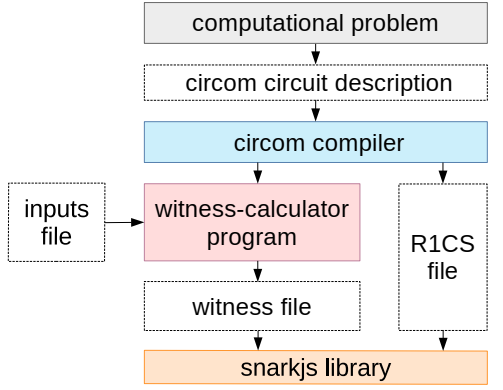

## ✊ Rock ✋ Paper ✌️ Scissors | MPC - coSNARKs

This project implements the game of rock-paper-scissors in the Circom language, employing advanced principles of cryptography such as zero-knowledge proofs and multi-party computation. The application allows players to participate without revealing their choices, using homomorphic encryption or a shared secret scheme to keep the moves private. This implementation demonstrates how the fundamentals of cryptography can be applied to games and other interactive applications in a secure and trustworthy manner.

## 🎯 Our Contribution

Our contribution is based on the implementation of the circuit for the rock-paper-scissors game `rps.circom`, in which we explore two innovative approaches:

1. **Implementing coSNARKs with co-circom**: Leveraging *Collaborative SNARKs* (coSNARKs), a 2021 innovation that merges the strengths of Multi-Party Computation (MPC) and zkSNARKs. This technology allows multiple parties, even if they do not trust each other, to collaborate to generate a zero-knowledge proof (ZKP) that guarantees the veracity of the computation without revealing each party's private inputs. Using [*co-circom* from TACEO](https://github.com/TaceoLabs/co-snarks), a tool that allows creating coSNARKs with circuits defined in Circom. Thus, coCircom expands the potential of zkSNARKs by providing collaborative proofs between multiple parties that protect data privacy and simplify verification.

2. **Integration of Circom templates with homomorphic encryption**: Integrate new efficient templates into Circom that allow encrypting plays and operating with this encrypted data within circuits. Using homomorphic encryption, plays remain private during operations, ensuring that each player's sensitive information is protected at all times.

3. **Educational and explanatory approach**: Highlight a strong educational approach, detailing each step of the process, from creating proofs in Circom and coSNARKs to developing smart contracts in Solidity. The game logic is supported by the `Verifier.sol` contract generated by *snarkjs*, which is integrated into Solidity to verify the validity of the proofs and manage the game safely and reliably on the blockchain.

This project addresses the challenge of computing on shared private data without relying on trusted third parties, providing a solution for creating private, verifiable and efficient proofs.

## ✅ Prerequisites

To get started with this project, make sure you have the following installed:

- [**Node.js**](https://nodejs.org/en/download/package-manager): Required to run JavaScript-based tools and scripts.
- [**Circom**](https://docs.circom.io/getting-started/installation/): Needed to define and compile zkSNARK circuits.
- [**Snarkjs**](https://www.npmjs.com/package/snarkjs): Used to generate and verify zkSNARK proofs, as well as to create verifier contracts in Solidity.

Please ensure each of these dependencies is installed and properly configured before proceeding.

## 📝 Documentation

This section describes each step in detail to make it easier to follow and contribute to the development of the project. Make sure to follow the steps in order and review each instruction before continuing.

### Step 1: Initial Setup and Dependencies
1. **Clone the repository:**
    ```bash
    git clone https://github.com/TaceoLabs/co-circom.git
    ```

2. **Install Circomlib**
The circuit `rps.circom` is already created, but to compile it correctly, we need to install the **circomlib** library. This library includes helper functions that are used in this project for example `comparators.circom`:
   ```circom
   include "../node_modules/circomlib/circuits/comparators.circom";
   ```
    To install the circomlib dependency, run the following command in the root of your project:
    ```bash
    npm install #circomlib
    ```
### Step 2: Creating the R1CS and Witness



In this step, we will build a zkSNARK **R1CS (Rank-1 Constraint System)** for the circuit `rps.circom`. The R1CS is an arithmetic representation of the circuit, which is used to define the constraints needed to verify a statement without revealing information about the inputs. This system is based on a series of multiplications and additions in a finite field defined in circom, which represent the operations performed in the circuit. For the circuit `rps.circom`, the R1CS will allow to analyze all the components needed for the arithmetization of a prover's statement.

> Make sure you are located in the /circuits path.
```bash 
circom rps.circom --inspect # inspect code (errors, warnings) 
circom rps.circom --r1cs --wasm --sym --json # compile (sym - signals) 
snarkjs r1cs info rps.r1cs # info (curve, qty. constraints and inputs...) 
snarkjs r1cs print rps.r1cs rps.sym # show constraints with signals 
snarkjs r1cs export json rps.r1cs rps.r1cs.json # better reading of r1cs (see mapping against .sym)
```

Each constraint is represented as a triplet of vectors $(a, b, c)$ satisfying a vector solution $w$, such that $(a \cdot w) ∗ (b \cdot w) = (c \cdot w)$ where $(\cdot)$ is the product of vectors and $(∗)$ the product of inputs, under modular prime arithmetic

$$p = 21888242871839275222246405745257275088548364400416034343698204186575808495617.$$

As defined in the `rps.r1cs.json` file, we force the numbers to stay within the field order. This finally translates into an R1CS of the form $(A \cdot w) ∗ (B \cdot w) = (C \cdot w)$ where $A, B$ and $C$ are $n \times m$ matrices that fully describe the computation in the arithmetic circuit, $n$ equal to the number of constraints and $m$ equal to the number of signals involved in the circuit plus 1, this element 1 is added at position $w_0 = 1$, because otherwise $w_0 = 0$ would satisfy all instances of R1CS. In this example $n = 17$ (`nVar` in `rps.r1cs.json`) and $m = 15$ (`nConstraints` in `rps.r1cs.json`). In the rps.r1cs.json object the map key sets the signals that generate the R1CS and in this way we know the value of $m$. A rank 1 constraint system must be fixed and immutable, this means that we cannot change the number of columns once defined, and we cannot change the values ​​of the matrices.

To better observe how the matrices $A, B, C$ that form the constraints of the `rps_constraints.json` files are defined, run the [matricesABC.py](scripts\matricesABC.py) python script (you need to have python3 installed) and pass as a parameter the value of $m$ (the number of columns of each matrix or signals that intervene in the circuit and form the witness $w$).
```bash
python ../scripts/matricesABC.py 15
```

#### Witness (Create input.json file)

The following `input.json` file with input signals player1 and player2 satisfy the R1CS and generates a valid token for the circuit, but the `input_1.json` file does not.

`input.json`
```js
{"player1": 2, "player2": 5}
```
`input_1.json`
```js
{"player1": 2, "player2": 1}
```

> Make sure you are located in the /rps_js path.
```bash
nano input.json # add signal input values
node generate_witness.js rps.wasm input.json witness.wtns # show log() if they exist
snarkjs wtns export json witness.wtns witness.json # better reading of witness
```

For the circuit input signals in the file `input.json` the following witness is satisfied.
```js
[
 "1",
 "1",
 "2",
 "5",
 "0",
 "6",
 "10",
 "1",
 "0",
 "1",
 "1",
 "14592161914559516814830937163504850059032242933610689562465469457717205663745",
 "1",
 "0",
 "0"
]
```

### Step 3: Building a QAP (R1CS -> QAP)

The R1CS represents our zero-knowledge proof but evaluating it is not succinct due to multiple matrix multiplications. A quadratic arithmetic program (QAP) is defined as a system of equations in which the coefficients are polynomials in a single variable. When we find a valid solution to this system of equations, we obtain a single polynomial equality. The quadratic characteristic refers to the fact that these systems involve exactly one polynomial multiplication. QAPs play a key role in the succinctness of zkSNARKs. We want to evaluate the polynomials and then compare the evaluations. Going from vector multiplication to polynomials is straightforward when the problem is posed as a homomorphism between algebraic rings. There is a homomorphism from a ring of n-dimensional column vectors with elements in $\mathbb{R}$ to the ring of polynomials with coefficients in $\mathbb{R}$. This means that we can transform our matrices $A$, $B$, and $C$ into polynomials while retaining the same properties.

Let's transform our R1CS to QAP using [SageMath](https://www.sagemath.org/download.html) (this procedure is done by the snarkjs library).

We define the finite field:

```python
p = 21888242871839275222246405745257275088548364400416034343698204186575808495617
2 Fp = GF(p)
```

We instantiate the matrices $A$, $B$ and $C$ that form R1CS for the circuit `rps.circom`.

```python
A = Matrix(Fp,
[[2, 0, 21888242871839275222246405745257275088548364400416034343698204186575808495616, 0, 0, 0, 0, 0, 0, 0, 0, 0, 0, 0, 0],
[21888242871839275222246405745257275088548364400416034343698204186575808495612, 0, 1, 0, 0, 0, 0, 0, 0, 0, 0, 0, 0, 0, 0],
[2, 0, 0, 21888242871839275222246405745257275088548364400416034343698204186575808495616, 0, 0, 0, 0, 0, 0, 0, 0, 0, 0, 0],
[21888242871839275222246405745257275088548364400416034343698204186575808495612, 0, 0, 1, 0, 0, 0, 0, 0, 0, 0, 0, 0, 0, 0],
[0, 0, 21888242871839275222246405745257275088548364400416034343698204186575808495616, 0, 0, 0, 0, 0, 0, 0, 0, 0, 0, 0, 0],
[21888242871839275222246405745257275088548364400416034343698204186575808495615, 0, 0, 0, 0, 0, 0, 0, 0, 1, 1, 0, 0, 0, 0],
[1, 0, 0, 0, 0, 0, 0, 21888242871839275222246405745257275088548364400416034343698204186575808495616, 0, 0, 0, 0, 0, 0, 0],
[0, 0, 0, 0, 0, 0, 0, 0, 1, 0, 0, 0, 0, 0, 0],
[21888242871839275222246405745257275088548364400416034343698204186575808495616, 0, 0, 0, 0, 0, 0, 0, 1, 0, 0, 0, 0, 0, 0],
[0, 0, 21888242871839275222246405745257275088548364400416034343698204186575808495616, 1, 0, 0, 0, 0, 0, 0, 0, 0, 0, 0, 0],
[0, 0, 21888242871839275222246405745257275088548364400416034343698204186575808495616, 1, 0, 0, 0, 0, 0, 0, 0, 0, 0, 0, 0],
[21888242871839275222246405745257275088548364400416034343698204186575808495616, 0, 0, 0, 0, 0, 0, 0, 0, 0, 0, 0, 1, 0, 0],
[21888242871839275222246405745257275088548364400416034343698204186575808495616, 0, 0, 0, 0, 0, 0, 0, 0, 0, 0, 0, 0, 1, 0],
[21888242871839275222246405745257275088548364400416034343698204186575808495616, 0, 16416182153879456416684804308942956316411273300312025757773653139931856371713, 5472060717959818805561601436314318772137091100104008585924551046643952123904, 0, 0, 0, 0, 0, 2, 0, 0, 5472060717959818805561601436314318772137091100104008585924551046643952123904, 10944121435919637611123202872628637544274182200208017171849102093287904247808, 0],
[0, 0, 0, 0, 0, 0, 0, 0, 0, 21888242871839275222246405745257275088548364400416034343698204186575808495616, 0, 0, 0, 0, 0],
[21888242871839275222246405745257275088548364400416034343698204186575808495607, 0, 0, 0, 0, 0, 1, 0, 0, 0, 0, 0, 0, 0, 0],
[21888242871839275222246405745257275088548364400416034343698204186575808495607, 0, 0, 0, 0, 0, 1, 0, 0, 0, 0, 0, 0, 0, 0]]
)
B = Matrix(Fp,
[[21888242871839275222246405745257275088548364400416034343698204186575808495614, 0, 1, 0, 0, 0, 0, 0, 0, 0, 0, 0, 0, 0, 0],
[0, 0, 0, 0, 1, 0, 0, 0, 0, 0, 0, 0, 0, 0, 0],
[21888242871839275222246405745257275088548364400416034343698204186575808495614, 0, 0, 1, 0, 0, 0, 0, 0, 0, 0, 0, 0, 0, 0],
[0, 0, 0, 0, 0, 1, 0, 0, 0, 0, 0, 0, 0, 0, 0],
[0, 0, 0, 1, 0, 0, 0, 0, 0, 0, 0, 0, 0, 0, 0],
[0, 0, 0, 0, 0, 0, 0, 1, 0, 0, 0, 0, 0, 0, 0],
[21888242871839275222246405745257275088548364400416034343698204186575808495616, 0, 0, 0, 0, 0, 0, 0, 0, 21888242871839275222246405745257275088548364400416034343698204186575808495616, 1, 0, 0, 0, 0],
[0, 1, 0, 0, 0, 0, 0, 0, 0, 0, 0, 0, 0, 0, 0],
[0, 1, 0, 0, 0, 0, 0, 0, 0, 0, 21888242871839275222246405745257275088548364400416034343698204186575808495616, 0, 0, 0, 0],
[0, 0, 0, 0, 0, 0, 0, 0, 0, 0, 0, 1, 0, 0, 0],
[0, 0, 0, 0, 0, 0, 0, 0, 1, 0, 0, 0, 0, 0, 0],
[0, 0, 0, 0, 0, 0, 0, 0, 0, 0, 0, 0, 1, 0, 0],
[0, 0, 0, 0, 0, 0, 0, 0, 0, 0, 0, 0, 0, 1, 0],
[0, 0, 16416182153879456416684804308942956316411273300312025757773653139931856371713, 5472060717959818805561601436314318772137091100104008585924551046643952123904, 0, 0, 0, 0, 0, 2, 0, 0, 5472060717959818805561601436314318772137091100104008585924551046643952123904, 10944121435919637611123202872628637544274182200208017171849102093287904247808, 0],
[1, 0, 0, 0, 0, 0, 0, 0, 0, 21888242871839275222246405745257275088548364400416034343698204186575808495616, 0, 0, 0, 0, 0],
[0, 0, 0, 0, 0, 0, 0, 0, 0, 0, 0, 0, 0, 0, 1],
[0, 0, 0, 0, 0, 0, 0, 1, 0, 0, 0, 0, 0, 0, 0]]
)
C = Matrix(Fp,
[[0, 0, 0, 0, 21888242871839275222246405745257275088548364400416034343698204186575808495616, 0, 0, 0, 0, 0, 0, 0, 0, 0, 0],
[0, 0, 0, 0, 0, 0, 0, 0, 0, 0, 0, 0, 0, 0, 0],
[0, 0, 0, 0, 0, 21888242871839275222246405745257275088548364400416034343698204186575808495616, 0, 0, 0, 0, 0, 0, 0, 0, 0],
[0, 0, 0, 0, 0, 0, 0, 0, 0, 0, 0, 0, 0, 0, 0],
[0, 0, 0, 0, 0, 0, 21888242871839275222246405745257275088548364400416034343698204186575808495616, 0, 0, 0, 0, 0, 0, 0, 0],
[0, 0, 0, 0, 0, 0, 0, 0, 0, 0, 0, 0, 0, 0, 0],
[0, 0, 0, 0, 0, 0, 0, 0, 0, 0, 0, 0, 0, 0, 0],
[0, 0, 0, 0, 0, 0, 0, 0, 0, 0, 0, 0, 0, 0, 0],
[0, 0, 0, 0, 0, 0, 0, 0, 0, 0, 0, 0, 0, 0, 0],
[1, 0, 0, 0, 0, 0, 0, 0, 21888242871839275222246405745257275088548364400416034343698204186575808495616, 0, 0, 0, 0, 0, 0],
[0, 0, 0, 0, 0, 0, 0, 0, 0, 0, 0, 0, 0, 0, 0],
[0, 0, 0, 0, 0, 0, 0, 0, 0, 0, 0, 0, 0, 0, 0],
[0, 0, 0, 0, 0, 0, 0, 0, 0, 0, 0, 0, 0, 0, 0],
[0, 0, 0, 0, 0, 0, 0, 0, 0, 0, 0, 0, 0, 0, 0],
[0, 0, 0, 0, 0, 0, 0, 0, 0, 0, 0, 0, 0, 0, 0],
[1, 0, 0, 0, 0, 0, 0, 21888242871839275222246405745257275088548364400416034343698204186575808495616, 0, 0, 0, 0, 0, 0, 0],
[0, 0, 0, 0, 0, 0, 0, 0, 0, 0, 0, 0, 0, 0, 0]]
)
```
They are not really matrices, they are sets $A$, $B$ and $C$ of vectors.

Now we tell SageMath what our witness is:

```python
w = vector(Fp, [1, 1, 2, 5, 0, 6, 10, 1, 0, 1, 1, 14592161914559516814830937163504850059032242933610689562465469457717205663745, 1, 0, 0])
```

The solution vector (witness) contains 15 elements, so we can build 15 polynomials. Each constraint contributes 1 point to each polynomial. We have 17 constraints, we get 17 points per polynomial. By [Lagrange's Interpolation](https://en.wikipedia.org/wiki/Lagrange_polynomial) Theorem, 17 points allow us to define a polynomial of degree at most 16. Each column of $A$, $B$, and $C$ has 17 elements. So, each of these columns can be converted into a polynomial of degree 16.

For example, the third column of $B$ is:

```bash
[1, 0, 0, 0, 0, 0, 0, 0, 0, 0, 0, 0, 0, 0, 16416182153879456416684804308942956316411273300312025757773653139931856371713, 0, 0, 0]
```

We can consider each element as the $y$-coordinate corresponding to $x \in \left\lbrace 1,2,...,17 \right\rbrace$. Then we get 17 sets of points:

```js
(1, 1), (2, 0), (3, 1), (4, 0), (5, 0), (6, 0), (7, 0), (8, 0), (9, 0), (10, 0), (11, 0), (12, 0), (13, 0), (14, 16416182153879456416684804308942956316411273300312025757773653139931856371713), (15, 0), (16, 0), (17, 0)
```

This is an arbitrary interpretation that we used to convert the R1CS to QAP format. We can find the polynomial that passes through these 17 points using Lagrange interpolation in SageMath:

```python
Rp.<x> = PolynomialRing(Fp)
points = [(1, 1), (2, 0), (3, 1), (4, 0), (5, 0), (6, 0), (7, 0), (8, 0), (9, 0), (10, 0), (11, 0), (12, 0), (13, 0), (14, 16416182153879456416684804308942956316411273300312025757773653139931856371713), (15, 0), (16, 0), (17, 0)]
polynomial = Rp.lagrange_polynomial(points)
polynomial
```

Then the polynomial corresponding to the third column of B is:

```python
15624624801003266146123744110675033400316102767028612663392052820050642052007*x^16 + 17628065561221056146420092394011072179943968248494275181725825496536971490283*x^15 + 17353592929480685758123766545248153217743635675656681004378327879647490967805*x^14 + 15996215007708504636513532868504604857740109347619408867212110683820354752672*x^13 + 15916998015778378463559132581592258263588077371489023180323232894149972371716*x^12 + 19593242095915470732852266693198891387964770812279165210956308854474009469479*x^11 + 19564098627772856912612858925738453011150982364337356489898970964472310787735*x^10 + 20857111160187485875104950557454773680299421998346142647015625344113457534794*x^9 + 8307009206713903184831845281372949038367251519948680457585572764145088699361*x^8 + 8598512473207131880157231846176769639620137928150157730655798801494736995497*x^7 + 21242051946697407586152144374283104207621490628614568335227311722044941646686*x^6 + 8638972196378427861180691635134304502128693335083771678556958974591611655189*x^5 + 3190896340709695064018868629520321230544004734997622169165467995876547024187*x^4 + 13049749194481386250557418139608526070829178377388106590695092533646799741735*x^3 + 8241942491040182995809668277856103073410276940007627418520083892492048931300*x^2 + 5079346670096912728445844592197433124215541954719143811673300244201100835198*x + 527
```

We calculate all the polynomials (45) by columns.

```python
M = [A, B, C]
PolyM = []
	
for m in M:
	PolyList = []
	for i in range(m.ncols()):
	    points = []
	    for j in range(m.nrows()):
	        points.append([j+1,m[j,i]])
	
	    Poly = Rp.lagrange_polynomial(points).coefficients(sparse=False)
	
	    if(len(Poly) < m.nrows()):
	        # if the degree of the polynomial is less than 6
            # we add zeros to represent the omitted terms
	        dif = m.nrows() - len(Poly)
	        for c in range(dif):
	            Poly.append(0);
	
	    PolyList.append(Poly)
	PolyM.append(Matrix(Fp, PolyList))
```
We build new matrices with the polynomial coefficients, for example `PolyM[0]` is now a matrix of dimension $15 \times 17$. By multiplying this `PolyM[0]` by the matrix that forms the witness vector only of dimension $17 \times 1$ we obtain, a matrix of dimension $17 \times 1$, which again we can transform into a single polynomial. In this way the set $A$ of vectors of the R1CS is transformed into a polynomial $Ax$.

```python
Ax = Rp(list(w*PolyM[0]))
Bx = Rp(list(w*PolyM[1]))
Cx = Rp(list(w*PolyM[2]))
print("A(x) = " + str(Ax))
print("B(x) = " + str(Bx))
print("C(x) = " + str(Cx))
```

Then we have that: R1CS: $A \cdot w ∗ B \cdot w = C \cdot w \Rightarrow$ QAP: $T(x) = A(x) \cdot B(x) − C(x)$.

```python
Tx= Ax * Bx - Cx
print("T(x) = " + str(Tx))
```

The verifier does not know the polynomial $T(x)$, nor can he compute it since he does not know the solution vector $w$ (witness). So, the prover has to prove to the verifier that $T(x) = 0$ for $x \in \left\lbrace 1,2,...,17 \right\rbrace$. We evaluate $T(x)$ at $x$.

```python
print("T(0) = " + str(Tx(0))) # T(0) = 7296080957279758407415468581752425029516121466805344781232734728861797292647
print("T(1) = " + str(Tx(1))) # T(1) = 0
print("T(7) = " + str(Tx(7))) # T(7) = 0
print("T(11) = " + str(Tx(11))) # T(11) = 0
print("T(17) = " + str(Tx(17))) # T(17) = 0
print("T(20) = " + str(Tx(20))) # T(20) = 52158647723208
print("T(50) = " + str(Tx(50))) # T(50) = 5518357011455093502173317821972068
```

We observe that evaluating any other point such as 0, 20 and 50 for example, is not a solution to this polynomial $T(x)$. This also means that there exists a polynomial $H(x)$, such that: $T(x) = H(x) \cdot Z(x)$ where $Z(x) = (x − 1)(x − 2)...(x − 17)$. In other words, the division $\dfrac{T(x)}{Z(x)}$ has no remainder and the result $H(x)$ is a polynomial $H(x) = \dfrac{T(x)}{Z(x)}$ and the verifier has to check that this is true. $Z(x)$ is known to both the Prover and the Verifier.

```python
Rp((x - 1)*(x - 2)*(x - 3)*(x - 4)*(x - 5)*(x - 6)*(x - 7)*(x - 8)*(x - 9)*(x - 10)*(x - 11)*(x - 12)*(x - 13)*(x - 14)*(x - 15)*(x - 16)*(x - 17))
Tx.quo_rem(Zx)
print("Cociente de Tx/Zx = ", Hx[0])
print("Resto de Tx/Zx = ", Hx[1])
```


# Resources
- [Circom Documentation](https://docs.circom.io/getting-started/installation/)
- [Explanatory video of the RPS circuit](https://youtu.be/AWA107F2uDQ)
- [coSNARKs docs - TACEO](https://docs.taceo.io/docs/primer/collabSNARKs-primer/)
- [SageMath docs](https://doc.sagemath.org/html/en/a_tour_of_sage/)