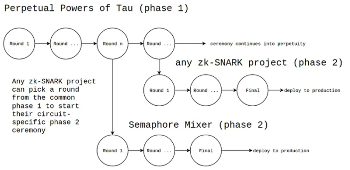
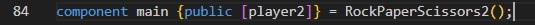
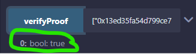
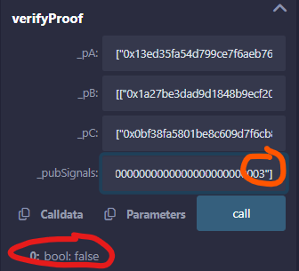

# Index

- [✊ Rock ✋ Paper ✌️ Scissors | MPC - coSNARKs](#-rock-paper-scissors--mpc---cosnarks)
- [🎯 Our Contribution](#-our-contribution)
- [✅ Prerequisites](#-prerequisites)
- [📝 Documentation zk-SNARKs](#-documentation-zk-snarks)
- [🎮 Understanding the game](#-understanding-the-game)
- [🔒 Private plays with co-SNARKs](#-private-plays-with-co-snarks)
- [⚡ Smart Contracts on Cairo | StarkNet - L2](#-smart-contracts-on-cairo--starknet---l2)

## ✊ Rock ✋ Paper ✌️ Scissors | MPC - coSNARKs

This project implements the game of rock-paper-scissors in the Circom language, employing advanced principles of cryptography such as zero-knowledge proofs and multi-party computation. The application allows players to participate without revealing their choices, using homomorphic encryption or a shared secret scheme to keep the moves private. This implementation demonstrates how the fundamentals of cryptography can be applied to games and other interactive applications in a secure and trustworthy manner.

## 🎯 Our Contribution

Our contribution is based on the implementation of the circuit for the rock-paper-scissors game `rps.circom`, in which we explore two innovative approaches:

1. **Implementing coSNARKs with co-circom**: Leveraging *Collaborative SNARKs* (coSNARKs), a 2021 innovation that merges the strengths of Multi-Party Computation (MPC) and zkSNARKs. This technology allows multiple parties, even if they do not trust each other, to collaborate to generate a zero-knowledge proof (ZKP) that guarantees the veracity of the computation without revealing each party's private inputs. Using [*co-circom* from TACEO](https://github.com/TaceoLabs/co-snarks), a tool that allows creating coSNARKs with circuits defined in Circom. Thus, coCircom expands the potential of zkSNARKs by providing collaborative proofs between multiple parties that protect data privacy and simplify verification.

2. **Integration of Circom templates with homomorphic encryption**: Integrate new efficient templates into Circom that allow encrypting plays and operating with this encrypted data within circuits. Using homomorphic encryption, plays remain private during operations, ensuring that each player's sensitive information is protected at all times.

3. **Educational and explanatory approach**: Highlight a strong educational approach, detailing each step of the process, from creating proofs in Circom and coSNARKs to developing smart contracts in Solidity. The game logic is supported by the `Verifier.sol` contract generated by *snarkjs*, which is integrated into Solidity to verify the validity of the proofs and manage the game safely and reliably on the blockchain.

This project addresses the challenge of computing on shared private data without relying on trusted third parties, providing a solution for creating private, verifiable and efficient proofs.

## ✅ Prerequisites

To get started with this project, make sure you have the following installed:

- [**Node.js**](https://nodejs.org/en/download/package-manager): Required to run JavaScript-based tools and scripts.
- [**Circom**](https://docs.circom.io/getting-started/installation/): Needed to define and compile zkSNARK circuits.
- [**Snarkjs**](https://www.npmjs.com/package/snarkjs): Used to generate and verify zkSNARK proofs, as well as to create verifier contracts in Solidity.
- [**co-circom**](https://docs.taceo.io/docs/getting-started/install/): Required to perform MPC (co-SNARK) with the private input signals in Circom
Please ensure each of these dependencies is installed and properly configured before proceeding.

## 📝 Documentation zk-SNARKs

This section describes each step in detail to make it easier to follow and contribute to the development of the project. Make sure to follow the steps in order and review each instruction before continuing.

### Step 1: Initial Setup and Dependencies
1. **Clone the repository:**
    ```bash
    git clone https://github.com/TaceoLabs/co-circom.git
    ```

2. **Install Circomlib**
The circuit `rps.circom` is already created, but to compile it correctly, we need to install the **circomlib** library. This library includes helper functions that are used in this project for example `comparators.circom`:
   ```circom
   include "../node_modules/circomlib/circuits/comparators.circom";
   ```
    To install the circomlib dependency, run the following command in the root of your project:
    ```bash
    npm install #circomlib
    ```
### Step 2: Creating the R1CS and Witness


In this step, we will build a zkSNARK **R1CS (Rank-1 Constraint System)** for the circuit `rps.circom`. The R1CS is an arithmetic representation of the circuit, which is used to define the constraints needed to verify a statement without revealing information about the inputs. This system is based on a series of multiplications and additions in a finite field defined in circom, which represent the operations performed in the circuit. For the circuit `rps.circom`, the R1CS will allow to analyze all the components needed for the arithmetization of a prover's statement.

> Make sure you are located in the /circuits path.
```bash 
circom rps.circom --inspect # inspect code (errors, warnings) 
circom rps.circom --r1cs --wasm --sym --json # compile (sym - signals) 
snarkjs r1cs info rps.r1cs # info (curve, qty. constraints and inputs...) 
snarkjs r1cs print rps.r1cs rps.sym # show constraints with signals 
snarkjs r1cs export json rps.r1cs rps.r1cs.json # better reading of r1cs (see mapping against .sym)
```

Each constraint is represented as a triplet of vectors $(a, b, c)$ satisfying a vector solution $w$, such that $(a \cdot w) ∗ (b \cdot w) = (c \cdot w)$ where $(\cdot)$ is the product of vectors and $(∗)$ the product of inputs, under modular prime arithmetic

$$p = 21888242871839275222246405745257275088548364400416034343698204186575808495617.$$

As defined in the `rps.r1cs.json` file, we force the numbers to stay within the field order. This finally translates into an R1CS of the form $(A \cdot w) ∗ (B \cdot w) = (C \cdot w)$ where $A, B$ and $C$ are $n \times m$ matrices that fully describe the computation in the arithmetic circuit, $n$ equal to the number of constraints and $m$ equal to the number of signals involved in the circuit plus 1, this element 1 is added at position $w_0 = 1$, because otherwise $w_0 = 0$ would satisfy all instances of R1CS. In this example $n = 17$ (`nVar` in `rps.r1cs.json`) and $m = 15$ (`nConstraints` in `rps.r1cs.json`). In the rps.r1cs.json object the map key sets the signals that generate the R1CS and in this way we know the value of $m$. A rank 1 constraint system must be fixed and immutable, this means that we cannot change the number of columns once defined, and we cannot change the values ​​of the matrices.

To better observe how the matrices $A, B, C$ that form the constraints of the `rps_constraints.json` files are defined, run the [matricesABC.py](scripts\matricesABC.py) python script (you need to have python3 installed) and pass as a parameter the value of $m$ (the number of columns of each matrix or signals that intervene in the circuit and form the witness $w$).
```bash
python ../scripts/matricesABC.py 15
```

#### Witness (Create input.json file)

The following `input.json` file with input signals player1 and player2 satisfy the R1CS and generates a valid token for the circuit, but the `input_1.json` file does not.

> Make sure you are located in the /rps_js path.

`input.json`
```js
{"player1": 2, "player2": 5}
```
`input_1.json`
```js
{"player1": 2, "player2": 1}
```

```bash
nano input.json # add signal input values
node generate_witness.js rps.wasm input.json witness.wtns # show log() if they exist
snarkjs wtns export json witness.wtns witness.json # better reading of witness
```

For the circuit input signals in the file `input.json` the following witness is satisfied.
```js
[
 "1",
 "1",
 "2",
 "5",
 "0",
 "6",
 "10",
 "1",
 "0",
 "1",
 "1",
 "14592161914559516814830937163504850059032242933610689562465469457717205663745",
 "1",
 "0",
 "0"
]
```

### Step 3: Building a QAP (R1CS -> QAP)

The R1CS represents our zero-knowledge proof but evaluating it is not succinct due to multiple matrix multiplications. A quadratic arithmetic program (QAP) is defined as a system of equations in which the coefficients are polynomials in a single variable. When we find a valid solution to this system of equations, we obtain a single polynomial equality. The quadratic characteristic refers to the fact that these systems involve exactly one polynomial multiplication. QAPs play a key role in the succinctness of zkSNARKs. We want to evaluate the polynomials and then compare the evaluations. Going from vector multiplication to polynomials is straightforward when the problem is posed as a homomorphism between algebraic rings. There is a homomorphism from a ring of n-dimensional column vectors with elements in $\mathbb{R}$ to the ring of polynomials with coefficients in $\mathbb{R}$. This means that we can transform our matrices $A$, $B$, and $C$ into polynomials while retaining the same properties.

Let's transform our R1CS to QAP using [SageMath](https://www.sagemath.org/download.html) (this procedure is done by the snarkjs library).

We define the finite field:

```python
p = 21888242871839275222246405745257275088548364400416034343698204186575808495617
2 Fp = GF(p)
```

We instantiate the matrices $A$, $B$ and $C$ that form R1CS for the circuit `rps.circom`.

```python
A = Matrix(Fp,
[[2, 0, 21888242871839275222246405745257275088548364400416034343698204186575808495616, 0, 0, 0, 0, 0, 0, 0, 0, 0, 0, 0, 0],
[21888242871839275222246405745257275088548364400416034343698204186575808495612, 0, 1, 0, 0, 0, 0, 0, 0, 0, 0, 0, 0, 0, 0],
[2, 0, 0, 21888242871839275222246405745257275088548364400416034343698204186575808495616, 0, 0, 0, 0, 0, 0, 0, 0, 0, 0, 0],
[21888242871839275222246405745257275088548364400416034343698204186575808495612, 0, 0, 1, 0, 0, 0, 0, 0, 0, 0, 0, 0, 0, 0],
[0, 0, 21888242871839275222246405745257275088548364400416034343698204186575808495616, 0, 0, 0, 0, 0, 0, 0, 0, 0, 0, 0, 0],
[21888242871839275222246405745257275088548364400416034343698204186575808495615, 0, 0, 0, 0, 0, 0, 0, 0, 1, 1, 0, 0, 0, 0],
[1, 0, 0, 0, 0, 0, 0, 21888242871839275222246405745257275088548364400416034343698204186575808495616, 0, 0, 0, 0, 0, 0, 0],
[0, 0, 0, 0, 0, 0, 0, 0, 1, 0, 0, 0, 0, 0, 0],
[21888242871839275222246405745257275088548364400416034343698204186575808495616, 0, 0, 0, 0, 0, 0, 0, 1, 0, 0, 0, 0, 0, 0],
[0, 0, 21888242871839275222246405745257275088548364400416034343698204186575808495616, 1, 0, 0, 0, 0, 0, 0, 0, 0, 0, 0, 0],
[0, 0, 21888242871839275222246405745257275088548364400416034343698204186575808495616, 1, 0, 0, 0, 0, 0, 0, 0, 0, 0, 0, 0],
[21888242871839275222246405745257275088548364400416034343698204186575808495616, 0, 0, 0, 0, 0, 0, 0, 0, 0, 0, 0, 1, 0, 0],
[21888242871839275222246405745257275088548364400416034343698204186575808495616, 0, 0, 0, 0, 0, 0, 0, 0, 0, 0, 0, 0, 1, 0],
[21888242871839275222246405745257275088548364400416034343698204186575808495616, 0, 16416182153879456416684804308942956316411273300312025757773653139931856371713, 5472060717959818805561601436314318772137091100104008585924551046643952123904, 0, 0, 0, 0, 0, 2, 0, 0, 5472060717959818805561601436314318772137091100104008585924551046643952123904, 10944121435919637611123202872628637544274182200208017171849102093287904247808, 0],
[0, 0, 0, 0, 0, 0, 0, 0, 0, 21888242871839275222246405745257275088548364400416034343698204186575808495616, 0, 0, 0, 0, 0],
[21888242871839275222246405745257275088548364400416034343698204186575808495607, 0, 0, 0, 0, 0, 1, 0, 0, 0, 0, 0, 0, 0, 0],
[21888242871839275222246405745257275088548364400416034343698204186575808495607, 0, 0, 0, 0, 0, 1, 0, 0, 0, 0, 0, 0, 0, 0]]
)
B = Matrix(Fp,
[[21888242871839275222246405745257275088548364400416034343698204186575808495614, 0, 1, 0, 0, 0, 0, 0, 0, 0, 0, 0, 0, 0, 0],
[0, 0, 0, 0, 1, 0, 0, 0, 0, 0, 0, 0, 0, 0, 0],
[21888242871839275222246405745257275088548364400416034343698204186575808495614, 0, 0, 1, 0, 0, 0, 0, 0, 0, 0, 0, 0, 0, 0],
[0, 0, 0, 0, 0, 1, 0, 0, 0, 0, 0, 0, 0, 0, 0],
[0, 0, 0, 1, 0, 0, 0, 0, 0, 0, 0, 0, 0, 0, 0],
[0, 0, 0, 0, 0, 0, 0, 1, 0, 0, 0, 0, 0, 0, 0],
[21888242871839275222246405745257275088548364400416034343698204186575808495616, 0, 0, 0, 0, 0, 0, 0, 0, 21888242871839275222246405745257275088548364400416034343698204186575808495616, 1, 0, 0, 0, 0],
[0, 1, 0, 0, 0, 0, 0, 0, 0, 0, 0, 0, 0, 0, 0],
[0, 1, 0, 0, 0, 0, 0, 0, 0, 0, 21888242871839275222246405745257275088548364400416034343698204186575808495616, 0, 0, 0, 0],
[0, 0, 0, 0, 0, 0, 0, 0, 0, 0, 0, 1, 0, 0, 0],
[0, 0, 0, 0, 0, 0, 0, 0, 1, 0, 0, 0, 0, 0, 0],
[0, 0, 0, 0, 0, 0, 0, 0, 0, 0, 0, 0, 1, 0, 0],
[0, 0, 0, 0, 0, 0, 0, 0, 0, 0, 0, 0, 0, 1, 0],
[0, 0, 16416182153879456416684804308942956316411273300312025757773653139931856371713, 5472060717959818805561601436314318772137091100104008585924551046643952123904, 0, 0, 0, 0, 0, 2, 0, 0, 5472060717959818805561601436314318772137091100104008585924551046643952123904, 10944121435919637611123202872628637544274182200208017171849102093287904247808, 0],
[1, 0, 0, 0, 0, 0, 0, 0, 0, 21888242871839275222246405745257275088548364400416034343698204186575808495616, 0, 0, 0, 0, 0],
[0, 0, 0, 0, 0, 0, 0, 0, 0, 0, 0, 0, 0, 0, 1],
[0, 0, 0, 0, 0, 0, 0, 1, 0, 0, 0, 0, 0, 0, 0]]
)
C = Matrix(Fp,
[[0, 0, 0, 0, 21888242871839275222246405745257275088548364400416034343698204186575808495616, 0, 0, 0, 0, 0, 0, 0, 0, 0, 0],
[0, 0, 0, 0, 0, 0, 0, 0, 0, 0, 0, 0, 0, 0, 0],
[0, 0, 0, 0, 0, 21888242871839275222246405745257275088548364400416034343698204186575808495616, 0, 0, 0, 0, 0, 0, 0, 0, 0],
[0, 0, 0, 0, 0, 0, 0, 0, 0, 0, 0, 0, 0, 0, 0],
[0, 0, 0, 0, 0, 0, 21888242871839275222246405745257275088548364400416034343698204186575808495616, 0, 0, 0, 0, 0, 0, 0, 0],
[0, 0, 0, 0, 0, 0, 0, 0, 0, 0, 0, 0, 0, 0, 0],
[0, 0, 0, 0, 0, 0, 0, 0, 0, 0, 0, 0, 0, 0, 0],
[0, 0, 0, 0, 0, 0, 0, 0, 0, 0, 0, 0, 0, 0, 0],
[0, 0, 0, 0, 0, 0, 0, 0, 0, 0, 0, 0, 0, 0, 0],
[1, 0, 0, 0, 0, 0, 0, 0, 21888242871839275222246405745257275088548364400416034343698204186575808495616, 0, 0, 0, 0, 0, 0],
[0, 0, 0, 0, 0, 0, 0, 0, 0, 0, 0, 0, 0, 0, 0],
[0, 0, 0, 0, 0, 0, 0, 0, 0, 0, 0, 0, 0, 0, 0],
[0, 0, 0, 0, 0, 0, 0, 0, 0, 0, 0, 0, 0, 0, 0],
[0, 0, 0, 0, 0, 0, 0, 0, 0, 0, 0, 0, 0, 0, 0],
[0, 0, 0, 0, 0, 0, 0, 0, 0, 0, 0, 0, 0, 0, 0],
[1, 0, 0, 0, 0, 0, 0, 21888242871839275222246405745257275088548364400416034343698204186575808495616, 0, 0, 0, 0, 0, 0, 0],
[0, 0, 0, 0, 0, 0, 0, 0, 0, 0, 0, 0, 0, 0, 0]]
)
```
They are not really matrices, they are sets $A$, $B$ and $C$ of vectors.

Now we tell SageMath what our witness is:

```python
w = vector(Fp, [1, 1, 2, 5, 0, 6, 10, 1, 0, 1, 1, 14592161914559516814830937163504850059032242933610689562465469457717205663745, 1, 0, 0])
```

The solution vector (witness) contains 15 elements, so we can build 15 polynomials. Each constraint contributes 1 point to each polynomial. We have 17 constraints, we get 17 points per polynomial. By [Lagrange's Interpolation](https://en.wikipedia.org/wiki/Lagrange_polynomial) Theorem, 17 points allow us to define a polynomial of degree at most 16. Each column of $A$, $B$, and $C$ has 17 elements. So, each of these columns can be converted into a polynomial of degree 16.

For example, the third column of $B$ is:

```bash
[1, 0, 0, 0, 0, 0, 0, 0, 0, 0, 0, 0, 0, 0, 16416182153879456416684804308942956316411273300312025757773653139931856371713, 0, 0, 0]
```

We can consider each element as the $y$-coordinate corresponding to $x \in \left\lbrace 1,2,...,17 \right\rbrace$. Then we get 17 sets of points:

```js
(1, 1), (2, 0), (3, 1), (4, 0), (5, 0), (6, 0), (7, 0), (8, 0), (9, 0), (10, 0), (11, 0), (12, 0), (13, 0), (14, 16416182153879456416684804308942956316411273300312025757773653139931856371713), (15, 0), (16, 0), (17, 0)
```

This is an arbitrary interpretation that we used to convert the R1CS to QAP format. We can find the polynomial that passes through these 17 points using Lagrange interpolation in SageMath:

```python
Rp.<x> = PolynomialRing(Fp)
points = [(1, 1), (2, 0), (3, 1), (4, 0), (5, 0), (6, 0), (7, 0), (8, 0), (9, 0), (10, 0), (11, 0), (12, 0), (13, 0), (14, 16416182153879456416684804308942956316411273300312025757773653139931856371713), (15, 0), (16, 0), (17, 0)]
polynomial = Rp.lagrange_polynomial(points)
polynomial
```

Then the polynomial corresponding to the third column of B is:

```python
15624624801003266146123744110675033400316102767028612663392052820050642052007*x^16 + 17628065561221056146420092394011072179943968248494275181725825496536971490283*x^15 + 17353592929480685758123766545248153217743635675656681004378327879647490967805*x^14 + 15996215007708504636513532868504604857740109347619408867212110683820354752672*x^13 + 15916998015778378463559132581592258263588077371489023180323232894149972371716*x^12 + 19593242095915470732852266693198891387964770812279165210956308854474009469479*x^11 + 19564098627772856912612858925738453011150982364337356489898970964472310787735*x^10 + 20857111160187485875104950557454773680299421998346142647015625344113457534794*x^9 + 8307009206713903184831845281372949038367251519948680457585572764145088699361*x^8 + 8598512473207131880157231846176769639620137928150157730655798801494736995497*x^7 + 21242051946697407586152144374283104207621490628614568335227311722044941646686*x^6 + 8638972196378427861180691635134304502128693335083771678556958974591611655189*x^5 + 3190896340709695064018868629520321230544004734997622169165467995876547024187*x^4 + 13049749194481386250557418139608526070829178377388106590695092533646799741735*x^3 + 8241942491040182995809668277856103073410276940007627418520083892492048931300*x^2 + 5079346670096912728445844592197433124215541954719143811673300244201100835198*x + 527
```

We calculate all the polynomials (45) by columns.

```python
M = [A, B, C]
PolyM = []
	
for m in M:
	PolyList = []
	for i in range(m.ncols()):
	    points = []
	    for j in range(m.nrows()):
	        points.append([j+1,m[j,i]])
	
	    Poly = Rp.lagrange_polynomial(points).coefficients(sparse=False)
	
	    if(len(Poly) < m.nrows()):
	        # if the degree of the polynomial is less than 6
            # we add zeros to represent the omitted terms
	        dif = m.nrows() - len(Poly)
	        for c in range(dif):
	            Poly.append(0);
	
	    PolyList.append(Poly)
	PolyM.append(Matrix(Fp, PolyList))
```
We build new matrices with the polynomial coefficients, for example `PolyM[0]` is now a matrix of dimension $15 \times 17$. By multiplying this `PolyM[0]` by the matrix that forms the witness vector only of dimension $17 \times 1$ we obtain, a matrix of dimension $17 \times 1$, which again we can transform into a single polynomial. In this way the set $A$ of vectors of the R1CS is transformed into a polynomial $Ax$.

```python
Ax = Rp(list(w*PolyM[0]))
Bx = Rp(list(w*PolyM[1]))
Cx = Rp(list(w*PolyM[2]))
print("A(x) = " + str(Ax))
print("B(x) = " + str(Bx))
print("C(x) = " + str(Cx))
```

Then we have that: R1CS: $A \cdot w ∗ B \cdot w = C \cdot w \Rightarrow$ QAP: $T(x) = A(x) \cdot B(x) − C(x)$.

```python
Tx= Ax * Bx - Cx
print("T(x) = " + str(Tx))
```

The verifier does not know the polynomial $T(x)$, nor can he compute it since he does not know the solution vector $w$ (witness). So, the prover has to prove to the verifier that $T(x) = 0$ for $x \in \left\lbrace 1,2,...,17 \right\rbrace$. We evaluate $T(x)$ at $x$.

```python
print("T(0) = " + str(Tx(0))) # T(0) = 7296080957279758407415468581752425029516121466805344781232734728861797292647
print("T(1) = " + str(Tx(1))) # T(1) = 0
print("T(7) = " + str(Tx(7))) # T(7) = 0
print("T(11) = " + str(Tx(11))) # T(11) = 0
print("T(17) = " + str(Tx(17))) # T(17) = 0
print("T(20) = " + str(Tx(20))) # T(20) = 52158647723208
print("T(50) = " + str(Tx(50))) # T(50) = 5518357011455093502173317821972068
```

We observe that evaluating any other point such as 0, 20 and 50 for example, is not a solution to this polynomial $T(x)$. This also means that there exists a polynomial $H(x)$, such that: $T(x) = H(x) \cdot Z(x)$ where $Z(x) = (x − 1)(x − 2)...(x − 17)$. In other words, the division $\dfrac{T(x)}{Z(x)}$ has no remainder and the result $H(x)$ is a polynomial $H(x) = \dfrac{T(x)}{Z(x)}$ and the verifier has to check that this is true. $Z(x)$ is known to both the Prover and the Verifier.

```python
Zx = Rp((x - 1)*(x - 2)*(x - 3)*(x - 4)*(x - 5)*(x - 6)*(x - 7)*(x - 8)*(x - 9)*(x - 10)*(x - 11)*(x - 12)*(x - 13)*(x - 14)*(x - 15)*(x - 16)*(x - 17))
Hx = Tx.quo_rem(Zx)
print("Cociente de Tx/Zx = ", Hx[0])
print("Resto de Tx/Zx = ", Hx[1])
```

### Step 3: Create the proof system configuration (Groth16)

When you run the script `quickSetup.sh` you will download a transcript of a trust ceremony where MPC was performed to generate these keys. This ceremony is secure because many people from the ecosystem have participated, including Vitalik, and it is available to everyone and anyone can make their contribution. This ceremony is called Perpetual Powers of Tau and any project can use it for its configuration. The configuration is always divided into two phases: Phase 1, Evaluate the polynomial T(x) (not dependent on the circuit) and Phase 2, generate the keys (depends on the circuit). For this reason in Groth16 if you change something in the circuit you have to do the configuration again. The configuration is not universal as in Plonk.



> Make sure you are at the root of the project

```bash
mkdir build
cp circuits/rps_1in_pr.r1cs build/
bash scripts/quickSetup.sh
```

### Step 4: Create zero-knowledge proofs

So with these two commands you can create proofs, but this can also be done in the browser (client) with a function, just like checking proofs in the browser (client) as well.

```bash
mkdir prover
snarkjs groth16 prove build/circuit_final.zkey circuits/rps_1in_pr_js/witness.wtns prover/proof.json prover/public.json
snarkjs groth16 fullprove circuits/rps_1in_pr_js/input.json circuits/rps_1in_pr_js//rps_1in_pr.wasm build/circuit_final.zkey prover/proof1.json prover/public1.json # generate witnesses and proofs at the same time
```

### Step 5: Verify zero-knowledge proofs

Verify zero-knowledge proofs

```bash
snarkjs groth16 verify build/verification_key.json prover/public.json prover/proof.json
```

#### On-chain verification

```bash 
mkdir contracts
snarkjs zkey export solidityverifier build/circuit_final.zkey contracts/Verifier.sol
snarkjs zkey export soliditycalldata prover/public.json prover/proof.json # parameters call to the Verifier.sol contract
```

## 🎮 Understanding the game

Players should have a way to know who won, lost or tied, after showing their proofs. We have been referring to the interaction from the point of view of the Prover (players of the game) and the Verifier of the Smart Contract in Ethereum. Not from the point of view of the players.

So, if we agree on that, there are two ways to make the game decisions:
1. **First way**: the `input.json` file has the moves `{player1: 2, player2: 5}`. From the input, the witness is created and with that witness a proof is generated. If we make the second move a public signal (we don't need zero knowledge for the second move) the game makes sense for one round. Since the first move is private, the first player will show a zero knowledge proof that he knows that move without showing it. The first player sends his proof on chain but he has to make a prior declaration that his move wins, loses or draws. Since the second move is a public signal that the second player will make later and the output of the circuit is another public signal, the Verifier.sol contract will simply verify whether the statement made by the prover, which is the first player, is fulfilled or not. The contract verifies that the public signals match the declared proof, or not. That is the first way that is feasible, but the drawback here is that the second move is public and ideally we would all like the idea of ​​all moves being private.

We have created a new circuit, but identical to the rps.circcom one, this one is called `rps_1in_pr.circom` to homologate this scenario that we discussed, the only difference is that the input of the second player is public and not private, the modification in the circuit is just the following line



After generating the Verifier.sol contract we can generate the parameters to call the function that verifies the proofs. For a successful proof the function returns true.



So if the player had played paper = 3. The public signal when you call Verifier does not satisfy the proof then the prover's statement is false and therefore he loses.



In a second case, each player must present a proof of their move that guarantees zero knowledge.

2. **Second way**: This is where collaborative zkSNARKs (coSNARKs) come in. The only way to ensure this is through MPC because you encrypt the two moves so that no one knows what the players played and you perform operations on that encrypted data homomorphically. Each player then creates a witness and a proof of their move. The proofs are then joined together using MPC to form a single proof that is verified on-chain.

## 🔒 Private plays with co-SNARKs

In this scenario, like the second way outlined above to run the game, both players inputs will be private, unlike the previous setup where only one of the moves was kept secret. We will use the `rps.circom` circuit to generate a witness and proofs for each player, ensuring that their choices remain confidential.

`input.json`

```js
{
	"a": "3", // signal private
	"b": "11" // signal private
}
```

Since we want to run an MPC protocol, we need to split the `input.json` file for parts. At this moment co-circom, supports 3 parts for witness extension. To do so, run the following command:

> Make sure you are located in the /circuits path.

```bash
mkdir out
co-circom split-input --circuit rps.circom --input rps_js/input.json --protocol REP3 --curve BN254 --out-dir out/
```
This command secret shares the private inputs (everything that is not explicitly public) and creates a `.json` file for each of the three parties

### Witness Extension
In a real situation, you need to send the input files from the previous step to the parties. To achieve this, we need a network configuration for each party (you can read a detailed explanation about the configuration [here](https://docs.taceo.io/docs/co-circom-cli/config/)). 
- You can download the TLS certificates from [GitHub TACEO](https://github.com/TaceoLabs/co-snarks/tree/c089006f5f17623518c6dc25b344ecfbf987c197/co-circom/examples/data) and put them under `data/`.
- We move the .toml files to `configs/` and execute the following command (for every party).

```bash
co-circom generate-witness --input out/input.json.0.shared --circuit rps.circom --protocol REP3 --curve BN254 --config configs/party0.toml --out out/witness.wtns.0.shared & co-circom generate-witness --input out/input.json.1.shared --circuit rps.circom --protocol REP3 --curve BN254 --config configs/party1.toml --out out/witness.wtns.1.shared & co-circom generate-witness --input out/input.json.2.shared --circuit rps.circom --protocol REP3 --curve BN254 --config configs/party2.toml --out out/witness.wtns.2.shared
```

After all parties finished successfully, you will have three witness files in your out/ folder. Each one of them contains a share of the extended witness.

### Prove the circuit

We need another MPC step to finally get our Groht16 proof of co-SNARK. We can reuse TLS certificates and network configuration. Also, we finally need the proof key!

```bash
co-circom generate-proof groth16 --witness out/witness.wtns.0.shared --zkey ../build/circuit_final.zkey --protocol REP3 --curve BN254 --config configs/party0.toml --out ../prover/proof.0.json --public-input ../prover/public_input.json & co-circom generate-proof groth16 --witness out/witness.wtns.1.shared --zkey ../build/circuit_final.zkey --protocol REP3 --curve BN254 --config configs/party1.toml --out ../prover/proof.1.json --public-input ../prover/public_input.json & co-circom generate-proof groth16 --witness out/witness.wtns.2.shared --zkey ../build/circuit_final.zkey --protocol REP3 --curve BN254 --config configs/party2.toml --out ../prover/proof.2.json --public-input ../prover/public_input.json
```

The three proofs produced by the separate parties are equivalent and valid Groth16 proofs. 

### Verify the Proof

To verify we can either use snarkjs or the co-circom binary.

```bash
co-circom verify groth16 --proof ../prover/proof.0.json --vk ../build/verification_key.json --public-input ../prover/public_input.json --curve BN254
snarkjs groth16 verify ../build/verification_key.json ../prover/public_input.json ../prover/proof.0.json
```

## ⚡ Smart Contracts on Cairo | StarkNet - L2

With the integration with Cairo, a Smart Contract can be created that executes and verifies the calculation procedures of the extended witness. When the parties divide their secret into three parts with co-SNARKs, if that execution is correct, STARKNET verifies it. The idea is that both players keep the move private and create their witness and their proof each on their PC. The idea is to use collaborative zkSNARKs using TACEO's co-circom library to generate an Extensible Witness, but we need this process to be carried out correctly and for this we can create a Smart contract in Cairo on Starknet that verifies that this calculation is correct so that when the proofs are generated with co-circom from the network configuration, users can deposit the proofs in a Verifier.sol contract in Ethereum after having approved the transaction in Ethereum that Starknet sent in the contract in Cairo that was executed correctly.

Take a look at [how to integrate starkli](https://medium.com/starknet-edu/starkli-the-new-starknet-cli-86ea914a2933) to declare, deploy, and interact with a smart contract and how to integrate it with Braavos or Argent X for a better developer experience.

```bash
scarb build
starkli declare target/dev/rps_ProofManager.contract_class.json
starkli deploy [class hash] [deployer]
```

Address Verifier - Layer 1: 0x46565B512A3E167b9196AD0B8eb3A14a7f593547
Address RockPaperScissorsVerifier - Layer 1: 0x9cA3aF3E64e3eDf6eCfd0deF15cc24E6B3eB5055
Address ProofManager - Layer 2: 0x0204521efe860b0e4ba290fda3994beafcb55835386bc7c4acfb2c5f5a587131
selector // 0x02ee206af5b468bd3a0f382f37441601d9b049ebb71196c282d2bab1af7b7062
Address Core - Layer 2: 0xE2Bb56ee936fd6433DC0F6e7e3b8365C906AA057


# Resources
- [Circom Documentation](https://docs.circom.io/getting-started/installation/)
- [Explanatory video of the RPS circuit](https://youtu.be/AWA107F2uDQ)
- [coSNARKs docs - TACEO](https://docs.taceo.io/docs/primer/collabSNARKs-primer/)
- [Explanatory video of co-SNARKs](https://youtu.be/w2HJxrDE01k?si=Rkt_1jKUxldK_hka)
- [SageMath docs](https://doc.sagemath.org/html/en/a_tour_of_sage/)